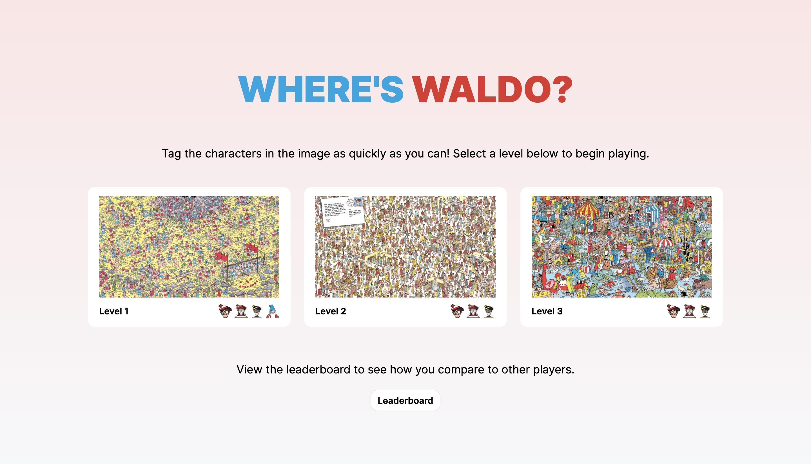

# Where's Waldo

### This is a "Where's Waldo" game (created to practice working with Firebase as a backend). 

## Live Demo

[Visit the site](https://currytay.github.io/wheres-waldo/)

**Note:** This website is best viewed on high res screens (1080p and up). Check the [improvements section](#improvements) for future updates.

**Landing page screenshot ↓**

## Project Details

### Prompt

From The Odin Project's [curriculum](https://www.theodinproject.com/paths/full-stack-javascript/courses/javascript/lessons/where-s-waldo-a-photo-tagging-app). 

### Built With

- ReactJS (bootstrapped with [Create React App](https://github.com/facebook/create-react-app))
- HTML5
- CSS3

## Improvements

Future features / opportunities for improvement:

- Make website mobile-friendly
- Add targeting box around cursor
- Add marker when user finds character